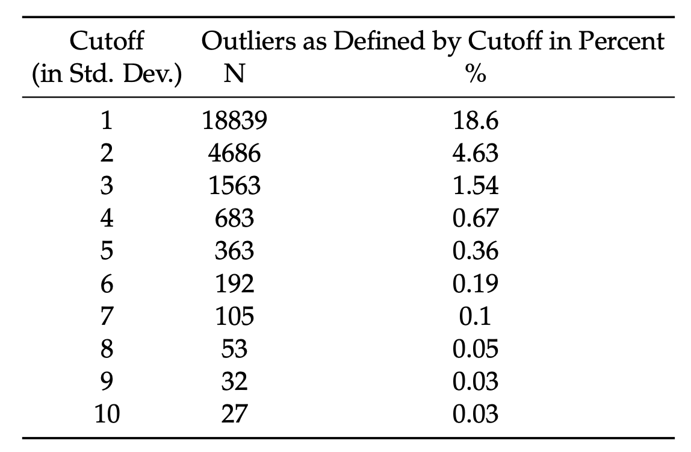

[](http://quantlet.de/)

## [](http://quantlet.de/) **osppaa_2021_descriptives** [](http://quantlet.de/)

```yaml

Name of Quantlet: osppaa_2021_descriptives

Published in: 'On Stablecoin Price Processes and Arbitrage (Pernice, 2021)'

Description: "The Quantlet loads raw data, filters it, generates descriptive statistics for the raw and cleaned data (performs outlier treatment on the raw data) and generates two LaTeX tables."

Keywords: Data Loading, Data Cleaning, descriptive Statistics, LaTeX Tables, Outlier Treatment, Data Summarization, Data Transformation

Author: Ingolf Pernice

See also: other Quantlets in this project

Submitted: 02.09.2023

Datafile: ../osppaa_data/inputdata_raw_hourly.csv (generated by the Quantlet osppaa_prepare_data)


```

