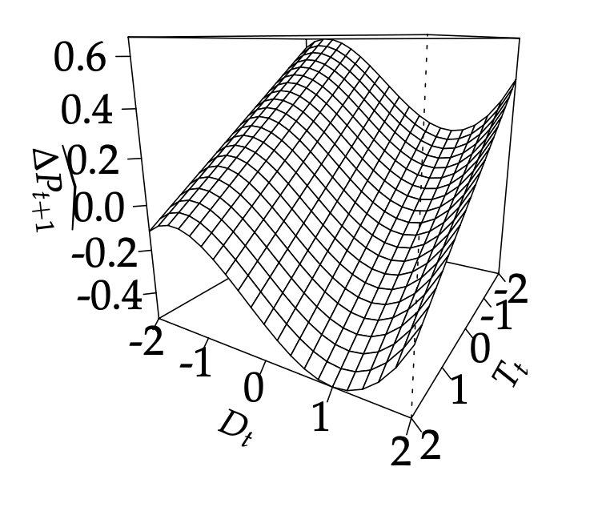

[](http://quantlet.de/)

## [](http://quantlet.de/) **osppaa_2021_draw_3dplots_st** [](http://quantlet.de/)

```yaml

Name of Quantlet: osppaa_2021_draw_3dplots_st

Published in: 'On Stablecoin Price Processes and Arbitrage (Pernice, 2021)'

Description: 'The Quantlet generates 3D perspective plots for two different mathematical models that describe the relationship between short term and long term trends and returns. It does so by defining the trends ST LT function twice with different equations, creating sequences of numbers to use as coordinates, calculating a matrix of returns, and then creating and saving the 3D perspective plots as LaTeX files.'

Keywords: '3D Plot, Trends, Peg Deviations, cryptocurrency, pricing, stablecoins'

Author: Ingolf Pernice

See also: other Quantlets in this project

Submitted: 02.09.2023

Datafile: None


```



### R Code
```r

## >> >> >> >> >> >> >> >> >> >> >> >> >> >> >> >> >> >> >> >> >> >> #
# >> PREP: Load data and packages                                    #
## >> >> >> >> >> >> >> >> >> >> >> >> >> >> >> >> >> >> >> >> >> >> #
source("yml_SETTINGS_loading.R")

hgt <- 2.5
wdt <- 2.5
##############################################################

trends_ST_LT <- function(st,dfv,mdl){
  - 0.259*dfv + 0.046*dfv^2 + 0.056*dfv^3 - 0.184*st + 0.000*st^2 + 0.000*st^3
}
trend_st <- seq(-2,2,0.2)
trend_lt <- seq(-2,2,0.2)
return <- outer(X = trend_st
                ,Y = trend_lt
                ,trends_ST_LT)


tikz(paste0(SETTINGS$modelling$resultspath,"3dplot_sT_mMCaV.tex")
     , standAlone = FALSE
     , width=wdt
     , height=hgt)


par(mgp=c(2,1,0), mar = c(0, 3, 0, 1))
persp(x = trend_st
      , y = trend_lt
      , z = return
      ## , xlim = range(x)
      ## , ylim = range(y)
      ## , zlim = range(z, na.rm = TRUE)
      , xlab = "\n $T_{t}$"
      , ylab = "\n $D_{t}$"
      , zlab = "\n\n $\\widehat{\\Delta P}_{t+1}$"
      , main = NULL
      , sub = NULL
      , theta = 120
      , phi = 15
      , r = sqrt(3)
      , d = 1
      , scale = TRUE
      , expand = 1
      , col = "white"
      , border = NULL
      , ltheta = -135
      , lphi = 0
      , shade = NA
      , box = TRUE
      , axes = TRUE
      , nticks = 5
      , cex.axis = 1.2
      , ticktype = "detailed")


dev.off()


##############################################################


```

automatically created on 2023-09-23