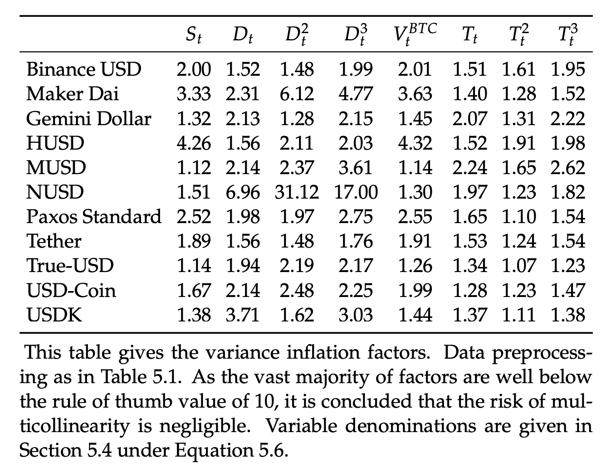

[](http://quantlet.de/)

## [](http://quantlet.de/) **osppaa_2021_fe_ols_assumptions_vif** [](http://quantlet.de/)

```yaml

Name of Quantlet: osppaa_2021_fe_ols_assumptions_vif

Published in: 'On Stablecoin Price Processes and Arbitrage (Pernice, 2021)'

Description: "The Quantlet is used to check and confirm several important assumptions (no multicollinearity, no omitted variable bias, no measurement error, and no unit roots) that are necessary for the robustness of the panel data model. It saves the results of the multicollinearity in LaTeX tables for further use."

Keywords: Unit Root Tests, Multicollinearity Tests, VIF, cryptocurrency, pricing

Author: Ingolf Pernice

See also: other Quantlets in this project

Submitted: 02.09.2023

Datafile: ../osppaa_data/inputdata_raw_hourly.csv (generated by the Quantlet osppaa_prepare_data)

```



### R Code
```r

## >> >> >> >> >> >> >> >> >> >> >> >> >> >> >> >> >> >> >> >> >> >> #
# >> PREP: Load data and packages                                    #
## >> >> >> >> >> >> >> >> >> >> >> >> >> >> >> >> >> >> >> >> >> >> #
source("yml_SETTINGS_loading.R")
load(paste0(SETTINGS$modelling$finaldatapath,"mT_mMCaV.Rdta"))


## >> >> >> >> >> >> >> >> >> >> >> >> >> >> >> >> >> >> >> >> >> >> #
# >> FE - Assumptions                                        #
## >> >> >> >> >> >> >> >> >> >> >> >> >> >> >> >> >> >> >> >> >> >> #

######################################################################
## No Multicollinearity
## - VIF + argue that not that problematic due to panel data
######################################################################

vif_raw <- getVIF(dta = dta[["norm"]],
                  exog = c(SETTINGS$descriptives$exog_pure
                          ,SETTINGS$descriptives$exog_sq
                          ,SETTINGS$descriptives$exog_qube),
              endog = SETTINGS$descriptives$endog)

vif <- round(vif_raw, digits = 2)

## latex table
                                        # Prepare naming
colnames(vif) <- rename_vars(colnames(vif))
rownames(vif) <- rename_coins(rownames(vif))
                                        # Prepare alignement
subtable_latex        <- xtable(vif,
                                align = "lcccccccc")
                                        # Print table
print(subtable_latex
    , file=paste0(SETTINGS$modelling$resultspath,"vif.tex")
    , sanitize.text.function = function(x) x
    , include.rownames=TRUE
    , include.colnames=TRUE,
    , floating = FALSE
    , booktabs = TRUE
    , hline.after = c(-1, 0, nrow(vif))
    , format.args = list(width = 1.5)
      )

```

automatically created on 2023-09-23