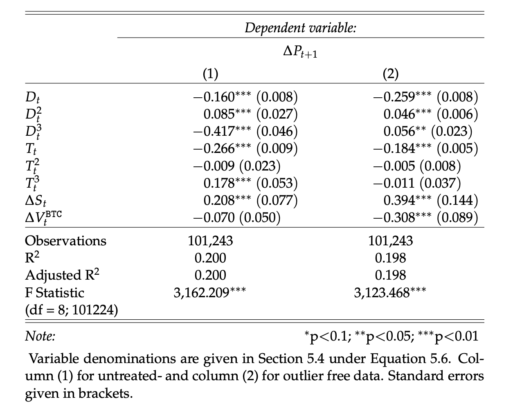

[](http://quantlet.de/)

## [](http://quantlet.de/) **osppaa_2021_model_tables_to_latex** [](http://quantlet.de/)

```yaml

Name of Quantlet: osppaa_2021_model_tables_to_latex

Published in: 'On Stablecoin Price Processes and Arbitrage (Pernice, 2021)'

Description: "The Quantlet is primarily focused on loading previously saved models and preparing robust standard errors for those models to then produce a table of results. Initially, it loads models saved in previous steps. It then calculates the robust standard errors for each of these models using the 'sandwich' package. Finally, it uses the 'stargazer' package to create a table that includes the estimated coefficients from the models along with the robust standard errors. This table is saved in a .tex format for later use. "

Keywords: Robust Standard Errors, Stargazer, Latex, cryptocurrency, prices

Author: Ingolf Pernice

See also: other Quantlets in this project

Submitted: 02.09.2023

Datafile: 1way_1fe_wT_mMCaV.Rdta, 1way_1fe_sT_mMCaV.Rdta (to be generated with the respective Quantlets 1fe_... and rbst1fe_...)


```

